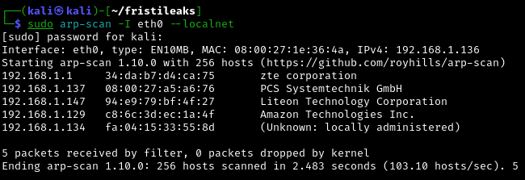

# Writeup

## Conocimiento de la red

Mediante el comando `arp-scan` hacemos un escaneo de la red para conocer la IP de la máquina.

## Conectividad con la máquina objetivo

Hacemos un ping para comprobar que tenemos conectividad con la máquina y vemos que tiene un **TTL** de 64, por lo que se trata de una máquina Linux.

## Escaneo de puertos y servicios

Hacemos un escaneo con nmap y utilizamos la siguiente sintaxis:

`sudo nmap -p- -sS -sC -sV --min-rate=5000 -n -vvv -Pn 192.168.1.137 -oN puertos`

Vemos que tiene el puerto 80 abierto y que existe el fichero **robots.txt** con posibles rutas.

Comprobamos la IP en el navegador y el archivo **robots.txt**.

Compruebo que en las tres rutas sale esto, por lo que se me ocurre hacer fuzzing web.

Hacemos uso de **gobuster** pero no me reporta nada. Por lo que empiezo a probar posibles rutas hasta que doy con una llamada **fristi**.

Ahora hacemos

